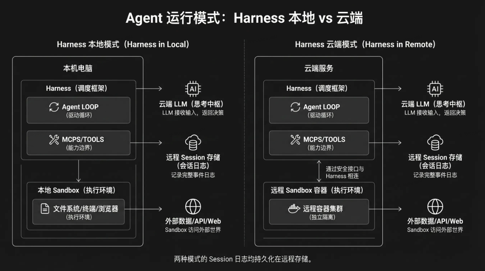
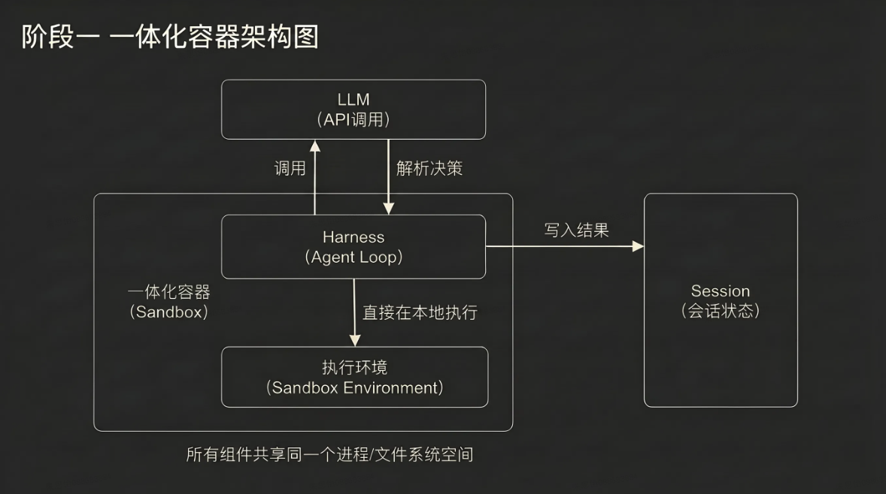
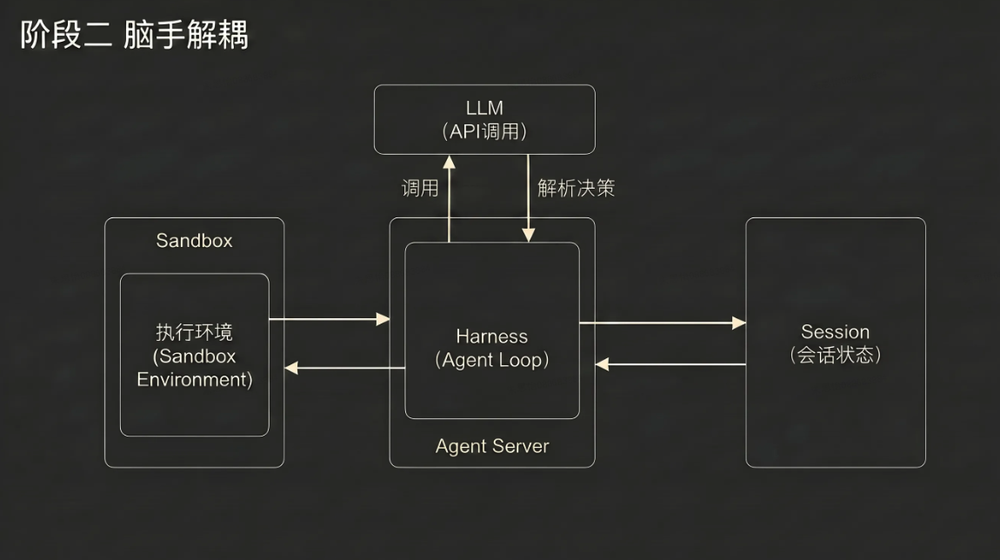

# 学习笔记：《解密 CatPaw Agent 的架构设计——如何让 Agent 长时间稳定运行》

---

## 一、从一个核心问题说起

一个 Agent 在短对话场景下表现良好，不代表它能在长任务场景下同样可靠。当 Agent 需要持续运行数小时完成一个复杂项目时，会遇到一系列短对话中不存在的问题：运行环境可能崩溃或超时、LLM 的上下文窗口会被撑满、中间状态可能丢失无法恢复、凭证和敏感信息的安全边界变得模糊。这些问题不是靠"写好 prompt"就能解决的，它们需要架构层面的系统性设计。

CatPaw Agent 平台同时支持两种环境运行模式——**本地模式（代表产品：CatDesk）**和**云端模式（代表产品：NoCode）**。两种模式面临的挑战不同，架构设计也不同，但背后遵循的核心原则是一致的。本文将从 Agent 的基本组成讲起，分别拆解两种模式的架构原理，然后深入上下文管理这个长时间运行中最关键的技术点。

---

## 二、Agent 的运行组成

在深入架构之前，先建立一个清晰的心智模型：一个能长时间运行的 Agent 到底由哪些部分组成？最广泛引用的经典公式：Agent = LLM + Planning + Memory + Tool Use。这个公式从认知能力的角度描述了 Agent 需要具备什么。但当我们要解决"怎么让 Agent 稳定运行"这个工程问题时，需要换一个视角——从运行时架构的角度来看 Agent 的组成。

> **※ 两套分类视角的对应关系**
>
> 这是两套完全不同视角的分类：
> - **Agent = LLM + Planning + Memory + Tool Use** → **认知能力**视角：Agent 需要具备哪些"智力功能"？（面向产品和用户）
> - **LLM + Harness + Sandbox + Session + Tools** → **运行时架构**视角：Agent 跑起来时各部分怎么分工？（面向工程实现）
>
> 两者的对应关系如下：
>
> | 认知能力视角 | 运行时架构视角 | 说明 |
> |---|---|---|
> | LLM | LLM | 一样，都是模型本身 |
> | Planning（规划） | LLM + Harness | 规划是 LLM 想出来的，Harness 负责把决策跑起来 |
> | Memory（记忆） | Session + 外部记忆 | Session 是短期/运行中记忆，MEMORY.md 是跨 Session 长期记忆 |
> | Tool Use（工具使用） | Tools + Sandbox | Tools 是工具定义，Sandbox 是工具真正执行的地方 |
>
> 光有第一套分类不够——它能描述 Agent 能做什么，但无法回答"挂了怎么恢复、怎么隔离故障、怎么扩展"。要解决长时间稳定运行的工程问题，必须用第二套架构视角来设计。

- **LLM（大语言模型）——思考中枢**。负责理解意图、推理规划、决定下一步做什么。当 Agent 面对一个复杂任务时，是 LLM 在思考应该先读哪个文件、该调用哪个工具、出了错该怎么恢复。但 LLM 本身是无状态的——每次调用时，你把上下文传进去，它返回一个决策，然后就忘了一切。它不能独立驱动一个持续运转的 Agent，需要有人反复调用它、喂给它上下文、路由它的决策。

- **Harness（调度框架）——驱动循环**。让 LLM 的思考持续运转的那个循环。它负责运行 Agent 的主循环（Agent Loop）：调用 LLM 获取决策 → 解析输出 → 把工具调用路由到正确的执行环境 → 收集执行结果 → 再次调用 LLM。LLM 和 Harness 合在一起，构成了 Agent 的"大脑"（Brain）——一个能持续思考和决策的整体。两种运行模式的核心区别，就在于这个 Loop 跑在哪里。

- **Sandbox（执行环境）——双手**。Agent 真正干活的地方——运行代码、编辑文件、执行终端命令、调用外部 API。注意，Sandbox 严格来说不属于 Agent 本身，而是 Agent 操作的外部环境。它意味着 Sandbox 可以被替换、被销毁重建，而 Agent 本身不受影响。

- **Session（会话日志）——记忆**。记录了 Agent 在单次运行过程中发生的所有事情——每次 LLM 的调用、每次工具的执行结果、每次状态的变化。关键点：Session 不是 LLM 的上下文窗口（context window）——上下文窗口是有限的、会被压缩的；Session 是完整的、持久化的、可以被回溯查询的。

  > **※ Session 长什么样？**
  >
  > Session 是一条**只追加、不修改**的事件流，以文章里的例子为基础，大概长这样：
  >
  > ```json
  > Session {
  >   sessionId: "sess_abc123",
  >   events: [
  >
  >     // ① 用户发起任务
  >     { id: "evt_001", type: "user_message", timestamp: "...",
  >       data: { content: "将这篇文章转成学城文档吧，在 xxx 下创建个子文档" } },
  >
  >     // ② LLM 第1轮决策：去读 SKILL.md
  >     { id: "evt_002", type: "llm_response", timestamp: "...",
  >       data: { text: "需要先读取 citadel skill...",
  >               tool_calls: [{ id: "call_1", name: "read_file",
  >                              input: { target_file: "/.catpaw/skills/citadel/SKILL.md" } }] } },
  >
  >     // ③ 工具执行结果：SKILL.md 内容
  >     { id: "evt_003", type: "tool_result", timestamp: "...",
  >       data: { tool_call_id: "call_1", output: "name: citadel, description: ..." } },
  >
  >     // ④ LLM 第2轮决策：检查 CLI 版本
  >     { id: "evt_004", type: "llm_response", timestamp: "...",
  >       data: { text: "了解了 skill 用法，开始创建文档",
  >               tool_calls: [{ id: "call_2", name: "todo_write", input: { ... } },
  >                            { id: "call_3", name: "run_terminal_cmd",
  >                              input: { command: "node -e '...检查CLI...'" } }] } },
  >
  >     // ⑤ 工具执行结果：CLI 已安装
  >     { id: "evt_005", type: "tool_result", timestamp: "...",
  >       data: { tool_call_id: "call_3", output: "@it/oa-skills" } },
  >
  >     // ... 后续每一轮的 llm_response 和 tool_result 依次追加 ...
  >
  >     // ⑨ 最终 LLM 返回文字结论，任务完成
  >     { id: "evt_009", type: "llm_response", timestamp: "...",
  >       data: { text: "学城文档已成功创建！链接是 https://km.sankuai.com/collabpage/xxx",
  >               tool_calls: [] } }   // 空数组 = 不再调用工具，Loop 结束
  >   ]
  > }
  > ```
  >
  > Session 和 LLM 的 Context Window 的关键区别：
  >
  > | | Session | Context Window |
  > |---|---|---|
  > | 存在哪里 | 外部持久化存储（数据库） | Harness 内存，随请求构建 |
  > | 长度限制 | 无限，只追加 | 有上限（如 200k token） |
  > | 会丢失吗 | 不会，Harness 挂了也在 | 进程结束即消失 |
  > | 内容 | 所有原始事件，完整 | Harness 精心"策展"过的子集 |
  >
  > Session 是**完整档案**，Context Window 是 Harness 每次喂给 LLM 的**摘要简报**。Harness 每次构建 LLM 请求时，就是从 Session 里用 `getEvents()` 取出相关事件，做压缩/裁剪后装进 Context Window——这正是第五章讲的上下文管理要解决的核心问题。

- **Tools（工具集合）——能力边界**。定义了 Agent 能做什么的工具描述集合。每个工具有名字、参数描述和返回值格式，Harness 在调用 LLM 时把这些定义传入，LLM 据此决定调用哪个工具。

---

> **※** 参考 Anthropic [博客原文](https://www.anthropic.com/engineering/managed-agents)，其将 Agent 虚拟化为三个独立组件：
>
> - **Session（会话日志）**，一个 append-only 的持久化事件流，独立于 harness 和 sandbox 存在。关键接口包括 `emitEvent(id, event)` 写入事件、`getEvents()` 读取事件切片。它是整个系统的"真相之源"，一条完整的、持久化的、只追加的事件时间线。——任何组件崩溃后都能从这里恢复。
>
> - **Harness（大脑/编排层）**，负责调用 Claude、路由工具调用、管理上下文等。崩溃后通过 `wake(sessionId)` 启动新实例，用 `getSession(id)` 拿回事件日志，从最后一个事件继续。不需要在 harness 内部维护任何需要存活的状态。
>
> - **Sandbox（双手/执行环境）**，Claude 运行代码和编辑文件的执行环境，负责接受指令、返回结果，仅此而已。通过统一接口 `execute(name, input) → string` 调用。Harness 不知道也不关心 sandbox 是容器、手机还是 Pokémon 模拟器，它可以是任意的 MCP SERVER、自定义工具。如果容器挂了，harness 把错误当普通工具调用失败传给 Claude，Claude 决定是否重试，重试时通过 `provision({resources})` 拉起新容器。
>
>   *__那么 Harness 是如何知道有哪些 Sandbox 的？实际上 Harness 不需要主动发现，而是 Sandbox 以工具定义的形式预先注册在 Claude，例如在 system prompt 里声明有哪些 tool 可用，这样就把"知道目标（用户需求）"和"知道手段（可用工具）"同时交给 Claude，让它在一个统一的推理过程中闭环决策。非常精妙的设计！__*

三者的关系可以用一句话概括：**Harness 是指挥者，Session 是记忆，Sandbox 是执行者。** 它们通过接口连接，但彼此独立，任何一个崩溃都不影响其他两个。

---

> **※** 展开看下 **Harness（大脑/编排层）**的主要职责：
>
> - **驱动 Agent 主循环。** 这是 Harness 最核心的职责。它运行一个循环：调用 Claude 获取决策 → 把 Claude 发出的工具调用路由到对应的 Sandbox 或外部服务 → 把结果喂回 Claude → 进入下一轮。整个 agent 的"思考-行动-观察"节奏就是由这个循环驱动的。*__注意！Harness 并不决策循环的走向，它只是个传话筒，真正是 Claude 自己判断下一步。__*
>
> - **管理上下文工程。** Claude 的 context window 是有限的，但长任务产生的事件流可能远超这个限制。Harness 负责从 Session 中通过 `getEvents()` 取回需要的事件切片，然后在喂给 Claude 之前做各种变换——包括 compaction（压缩摘要）、context trimming（裁剪旧的工具结果或 thinking blocks）、以及组织 token 排列以提高 prompt cache 命中率。换句话说，Claude 看到的 context window 内容是 Harness 精心"策展"过的，而不是 Session 的原始事件流。*__此处有个疑问，Harness 是如何决策选取 Session 中的哪些事件切片的？原文中并没有直接给出答案，而是阐述这套架构下选取策略是可灵活调整的。__*
>
> - **维护 Session 的事件记录。** Harness 在循环的每一步都通过 `emitEvent(id, event)` 把发生的事情写入 Session——Claude 的响应、工具调用的输入输出、错误信息等。这保证了即使 Harness 自身崩溃，所有已发生的事件都已持久化，新的 Harness 实例可以无缝接续。*__注意！Harness 自身不存储任何状态，完全靠 Session 写入机制管理。__*
>
> - **故障恢复。** Harness 自身被设计为无状态的"牛群"。崩溃后，新实例通过 `wake(sessionId)` 启动，用 `getSession(id)` 拿回事件日志，从最后一个事件继续执行。不需要任何本地状态的恢复。
>
> - **按需编排 Sandbox。** Harness 不预先启动容器，而是在 Claude 真正需要执行操作时才通过 `provision({resources})` 拉起 Sandbox，通过 `execute(name, input) → string` 发送指令。如果 Sandbox 挂了，Harness 把错误作为工具调用失败传回给 Claude，由 Claude 决定下一步。
>
> - **处理安全代理。** 对于需要凭证的外部服务调用（比如 MCP 工具），Harness 通过专用代理完成。代理拿着与 session 关联的 token 去 vault 取真实凭证，再调用外部服务。Harness 本身不持有也不传递任何凭证，Sandbox 更不会接触到。这个安全边界的维护也是 Harness 的职责之一。

---

> **※** 最后总结下来，Anthropic 的整个 Managed Agents 架构设计其实是在赌两件事：1）模型的推理能力足够强，强到比硬编码逻辑更可靠，而这点已经在 Sonnet 4.5 -> Opus 4.5 得到论证；2）把决策空间尽可能大地留给模型，Harness 只提供可靠的基础设施和干净的信息输入。***未来模型更强了，这个架构不需要改——因为它本来就没限制模型能做什么。***

---

理解了这五个组成部分，接下来的问题是：在不同的运行环境中，这些组件怎么部署、怎么协作、怎么应对故障？这就是两种架构模式要回答的问题。



---

## 三、本地模式：以 CatDesk 为例

CatDesk 是 Cat-Labs 下的桌面端 Agent 应用，代表了本地模式的架构思路。在这个模式下，Harness 和 Sandbox 都运行在用户的本地电脑上，LLM 在云端负责推理，结果回到本地执行。

### 3.1 Loop 在本地

本地模式最核心的特征是：**Agent Loop 跑在用户的电脑上**。Harness 在本地驱动整个循环——调用云端 LLM 获取决策，然后直接在本地执行。文件编辑就是本地文件系统调用，终端命令就是直接的 shell 执行，浏览器操作就是控制本地浏览器。没有远程容器，没有服务边界，延迟极低。

这个架构的优势非常明显。用户数据不离开本机，隐私性好。直接操作本地环境，没有网络传输的开销。用户随时可以看到 Agent 在做什么、随时可以介入和干预，可控性强。对于"我就希望在我电脑上，让 Agent 帮我协同干活"这个场景，本地模式是最自然的选择。

---

> **※** Harness 发给 LLM 的请求，结构大致是这样的：
>
> ```json
> [system message]        → system prompt（身份、规则、工具定义、skill 列表、用户信息）
>
> [messages 数组]          → 对话历史，按时间顺序排列：
>   - user message        → 你的第一条消息
>   - assistant message   → LLM的回复（可能包含 tool_use 块）
>   - tool message        → 本地工具执行结果（tool_result）
>   - assistant message   → LLM基于工具结果的回复
>   - user message        → 你的第二条消息
>   - ...
>   - user message        → 你刚刚发的最新消息
> ```
>
> 注：其中 assistant message 里如果 LLM 决定调用工具，它的内容不是纯文字，而是一个结构化的 tool_use 块，包含工具名和参数。紧跟着的 tool message 就是 Harness 执行完工具后返回的结果。

---

> **※** 举个例子：当我和 CatDesk 说"将这篇文章转成学城文档吧"，其规划出了三步执行：1）确保 CLI 最新版本（学城 skill 里要求的）；2）把文章内容创建为学城文档；3）验证文档创建成功；
>
> Agent Loop 的关键步骤和消息结构大致如下：
>
> **第 1 轮**
>
> Harness 把 system prompt + 你的消息原文发给 LLM：
>
> ```json
> system: [system prompt 全文，几万 token]
> messages: [
>   {role: "user",
>    content: "将这篇文章转成学城文档吧，在 xxx 下创建个子文档"}
> ]
> ```
>
> LLM 返回：我要调用 read_file 工具读取 citadel skill 的 SKILL.md：
>
> ```json
> {role: "assistant", content: [
>   {type: "text",
>    text: "这是一个 sankuai.com 链接，我需要先读取 citadel skill..."},
>   {type: "tool_use",
>    id: "call_1",
>    name: "read_file",
>    input: {target_file: "/.catpaw/skills/.../citadel/SKILL.md"}}
> ]}
> ```
>
> 注：LLM 之所以能够知道有个 citadel skill，是因为 system prompt 里列出了所有可用的 skill 及描述。
>
> Harness 检测到响应里有 tool_use → 不是最终回复，进入执行阶段。Harness 在本地读取文件，拿到内容，构建 tool message，追加到消息数组。
>
> ---
>
> **第 2 轮**
>
> Harness 把补充过 skill.md 的对话历史再发给 LLM：
>
> ```json
> system: [system prompt 全文，不变]
> messages: [
>   {role: "user", content: "将这篇文章转成学城文档吧..."},
>   {role: "assistant", content: [
>     {text: "..."},
>     {tool_use: "read_file", id: "call_1", ...}]
>    },
>   {role: "tool",
>    tool_use_id: "call_1",
>    content: "name: citadel, description: [SKILL.md 全文]"},
> ]
> ```
>
> LLM 看完 skill 文档后返回：我要调用 run_terminal_cmd 检查 CLI 版本：
>
> ```json
> {role: "assistant", content: [
>   {type: "text",
>    text: "现在我了解了学城 skill 的用法。让我来创建这篇文章为学城子文档。"},
>   {type: "tool_use",
>    id: "call_2",
>    name: "todo_write",
>    input: {merge: false,
>            todos: [{id:"1",
>                     content:"确保 oa-skills CLI 为最新版本",
>                     status:"in_progress"}, ...]}},
>   {type: "tool_use",
>    id: "call_3",
>    name: "run_terminal_cmd",
>    input: {command: "node -e \"...检查CLI...\"",
>            is_background: false}}
> ]}
> ```
>
> 注1：这里一次返回了两个 tool_use。Harness 判断工具调用之间没有依赖关系时，就会在一次回复中同时请求调用多个工具，并收集多个结果。
> 注2："todo_write" 工具就是 CatDesk 界面上展示的可视化进度追踪。
>
> Harness 再次检测到 tool_use → 本地执行终端命令 → 拿到输出 → 追加 tool message。
>
> ---
>
> **第 3 轮**
>
> Harness 在本地跑完终端命令，把检查结果拼回去发送给 LLM：
>
> ```json
> system: [system prompt 全文]
> messages: [
>   {role: "user", content: "将这篇文章转成学城文档吧..."},
>   {role: "assistant",
>    content: [{text}, {tool_use: call_1}]},
>   {role: "tool",
>    tool_use_id: "call_1",
>    content: "[SKILL.md 内容]"},
>   {role: "assistant",
>    content: [{text}, {tool_use: call_2}, {tool_use: call_3}]},
>   {role: "tool",
>    tool_use_id: "call_2",
>    content: "Successfully updated the todo list..."},
>   {role: "tool",
>    tool_use_id: "call_3",
>    content: "@it/oa-skills"},
> ]
> ```
>
> LLM 看到 CLI 已安装，返回：我要调用 write 工具把文章内容写入临时文件：
>
> ```json
> {role: "assistant", content: [
>   {type: "text",
>    text: "我需要先把内容写入文件，然后用文件方式创建文档。"},
>   {type: "tool_use",
>    id: "call_6",
>    name: "write",
>    input: {file_path: "./catpaw desk/article_content.md",
>            contents: "让一个 Agent 跑起来不难..."}}
> ]}
> ```
>
> 同样的模式不断重复。每轮 Harness 发送的 messages 数组都在增长，之前所有的 assistant message 和 tool message 都保留在里面。
>
> ---
>
> **第 4 轮**
>
> Harness 执行完写文件后将结果告诉 LLM：
>
> ```json
> system: [system prompt 全文]
> messages: [
>   ...前面所有消息...,
>   {role: "assistant",
>     content: [{text}, {tool_use: call_6}]},
>   {role: "tool",
>     tool_use_id: "call_6",
>     content: "The content was successfully saved to xxx"},
> ]
> ```
>
> LLM 返回：我要创建学城文档，调用 run_terminal_cmd 执行：
>
> ```json
> {role: "assistant", content: [
>   {type: "text", text: "让我用文件方式创建文档吧"},
>   {type: "tool_use",
>    id: "call_8",
>    name: "run_terminal_cmd",
>    input: {
>      command: "cd xxx && oa-skills citadel createDocument xxx",
>      is_background: false}}
> ]}
> ```
>
> ---
>
> **第 5 轮**
>
> Harness 执行完创建文档后将结果告诉 LLM：
>
> ```json
> system: [system prompt 全文]
> messages: [
>   ...前面所有消息...,
>   {role: "assistant",
>     content: [{text}, {tool_use: call_8}]},
>   {role: "tool",
>     tool_use_id: "call_8",
>     content: "✅ 文档创建成功！访问链接：xxx"},
> ]
> ```
>
> LLM 判断任务完成，不再调用工具，直接返回文字回复：
>
> ```json
> {role: "assistant", content: [
>   {type: "text",
>    text: "学城文档已成功创建！链接是 xxx"}
> ]}
> ```
>
> Harness 检测到响应里**没有 tool_use**，只有纯文本 → 这是最终回复 → Loop 结束 → 把文字渲染到界面上展示给你。

---

### 3.2 本地模式的长时间运行挑战

本地模式的局限也很清楚：Agent 的运行依赖用户的电脑保持在线。电脑关机、休眠、网络断开，Agent 就停了。Harness 和 Sandbox 绑在同一台机器上，无法独立扩展。但对于 CatDesk 的使用场景，这些局限是可以接受的——用户就在电脑前，Agent 的核心价值是直接操作本地环境。

CatDesk 对此有几个应对策略：
- **系统级防休眠**：当 Agent 正在执行任务时，CatDesk 通过系统 API 阻止电脑进入休眠状态，避免长时间任务因系统休眠而意外中断。
- **会话持久化与断点恢复**：即使应用意外退出，重启后也能从最后的状态继续工作，而不是从头开始。
- **手机端远程控制（Mobile Remote Control）**：用户不在电脑旁时，可以通过手机端向本地电脑上的 CatDesk 发送指令，远程触发 Agent 执行任务或查看执行状态。这意味着"人必须在电脑前"的约束被放松了：电脑只需要保持开机在线，用户可以随时随地通过移动端与本地 Agent 交互。

本地模式真正需要深入解决的长时间运行问题集中在**上下文管理**上——当一个任务持续执行几十分钟甚至几个小时，LLM 的上下文窗口如何不被撑爆、如何保持高质量的推理。这部分在第五章详细展开。

---

## 四、云端模式：一场脑手分离的架构演进

当 Agent 需要 7x24 持续运行、不依赖用户干预时，就需要云端模式。和本地模式不同，云端没有人坐在"电脑"前面——可靠性、安全性、可观测性，全部需要架构自身来保障。

CatPaw 的云端架构不是一步到位的，而是经历了一次关键的架构演进。这个演进过程和 Anthropic 在构建 Managed Agents 时走过的路径高度相似——他们在博客中将其概括为"Decoupling the Brain from the Hands"（大脑与双手解耦）。我们也是从一体化容器起步，逐步走向了脑手分离的架构。下面用两个阶段来讲这个故事。

### 4.1 阶段一：一体化容器——Harness in Sandbox

云端模式最直觉的做法，也是 CatPaw 最初采用的做法，是把所有东西塞进一个容器——既然本地模式下 Harness 和 Sandbox 住在同一台机器上运行得不错，那云端只要把"本地电脑"换成"远程容器"就行了。远程创建一个 Sandbox 容器，Harness 也跑在里面，Agent Loop 在容器内部驱动一切。

这个架构有实实在在的好处。文件编辑是直接的系统调用，不用跨网络，也没有服务边界需要设计。对于快速验证"云端 Agent 能不能跑起来"这个问题，一体化容器是最短路径。



但当 Agent 需要长时间运行时，它的一些问题也会暴露出来。它有状态、挂了就会有损；而且出现问题的时候较难区分故障来源——Harness 的一个 bug、一次网络丢包、容器本身宕机，同时要定位原因，工程师需要进入容器开 shell 调试，但容器里存着用户数据和凭证，出于安全考虑这条路基本走不通。

安全问题同样棘手。Agent 需要的凭证（Git token、OAuth token 等）和 LLM 生成的不可信代码运行在同一个环境中。一次成功的 prompt injection 只需要说服 LLM 去读取它自己环境中的凭证，随着模型越来越聪明，今天安全的限制明天可能就不够了。

还有扩展性和性能的瓶颈。Harness 假定所有资源都在容器里，当客户需要 Agent 操作自己 VPC 里的资源时，较难扩展。性能上，每启动一个 session 都要先拉起容器、克隆仓库、初始化环境，即使用户只是问一个简单问题也得等。这直接拖慢了 TTFT（Time To First Token），是用户最直接感受到的延迟。

概括起来，一体化容器在五个方面碰了壁：**可靠性**（容器挂了不可恢复）、**可观测性**（故障原因混在一起无法区分）、**安全性**（凭证与不可信代码共存）、**扩展性**（资源必须在容器里的假设）、**性能**（每个 session 都要等容器就绪）。这些问题不是个别的 bug，而是架构本身的结构性限制。要解决它们，需要的不是在现有架构上修修补补，而是一次架构层面的演进。

---

> **※ 为什么 Harness 在不在容器里差别这么大？**
>
> 核心原因是：**Harness 是有"脑子"的，Sandbox 是没有脑子的。** 把有脑子的东西和执行环境绑在一起，就导致了"一荣俱荣、一损俱损"。
>
> 理解这个问题，需要先理解**状态**的概念：
>
> > **状态 = 一个程序"记得"的东西。** 程序运行过程中，凡是需要"记住"才能继续工作的信息，都叫状态。
> > - **有状态**：你问我"上次说到哪了？"我能回答。
> > - **无状态**：你每次来，我都当第一次见你。
>
> **Sandbox 天然应该是无状态的**——它只是一双手，执行完一个命令返回结果就没它什么事了，手断了换一双就好。
>
> **Harness 天然有状态**——它脑子里装着"现在任务进行到哪一步了"、"上下文是什么"、"下一步该调哪个工具"。它挂了，这些东西就没了。
>
> 阶段一把两者塞进同一容器，等于**容器的命就是 Harness 的命**：
>
> ```
> 容器挂了
>   ↓
> Harness 死了（任务状态全丢）
>   + Sandbox 也死了（执行环境没了）
>   ↓
> 无法区分：到底是谁的问题导致容器挂的？
> 无法恢复：状态在 Harness 内存里，随容器一起消失了
> ```
>
> 所以"无状态"不是真的什么都不记，而是：**我自己不存，但我把需要记的东西都写到外面去了。**
>
> ```
> 有状态的 Harness：状态存在自己的内存里
>   → 我挂了，状态没了，任务凉了
>
> 无状态的 Harness：每一步都把状态写入 Session（外部持久化）
>   → 我挂了，Session 还在
>   → 新的 Harness 启动，读 Session，从断点继续
> ```
>
> 这就是 `emitEvent()` 的作用——Harness 每做一件事，立刻把这件事写出去，自己不留底。它随时可以死，因为它随时可以被重建。
>
> 用餐厅打比方：
>
> | | 阶段一 | 阶段二 |
> |---|---|---|
> | 大厨（Harness） | 住在厨房里 | 住在独立办公室 |
> | 厨房（Sandbox） | 同一个房间 | 独立隔离空间 |
> | 订单记录（Session） | 大厨脑子里记着 | 写在外部系统里 |
>
> 阶段一，厨房着火了，大厨也跑了，订单全忘了，整个餐厅瘫痪。阶段二，厨房着火了，换一间厨房，大厨去办公室查订单记录继续干活；大厨自己出问题，换个大厨来查记录接着做。**任何一个环节坏掉，另外两个不受影响。**
>
> 这也解释了为什么阶段一"看起来能跑"——在短任务、小规模场景下，容器挂的概率低，偶尔挂了重启一下也还行。但当任务需要跑几个小时、同时有几十万个 Sandbox 在跑时，概率问题变成必然问题，阶段一的结构性缺陷就暴露无遗了。

---

### 4.2 阶段二：脑手解耦——Sandbox as Tool

阶段一的核心矛盾是：所有组件耦合在一个容器里，任何一个出问题，其他的都跟着倒。解决思路很直接——把它们拆开，让每个组件独立存在、独立故障、独立替换。Anthropic 把这个思路叫"Decoupling the Brain from the Hands"。

**Harness 搬出容器。** Harness 不再住在 Sandbox 容器里，而是变成一个独立运行的服务。它通过一个极简的统一接口调用 Sandbox：



Harness 调用 Sandbox 的方式，和它调用任何其他工具一样，它让 Sandbox 成为一个纯粹的"能力提供者"，Harness 不关心对面是一个 Docker 容器、一台物理机还是一个 Kubernetes Pod。这个改变让 Sandbox 变成了无状态：容器挂了？Harness 捕获到一个工具调用错误，传回给 LLM，LLM 决定要不要重试。要重试就重新拉起一个新容器就行。不再需要"抢救"卡死的容器——挂了就换。故障排查也变得清晰了：Harness 的问题、Sandbox 的问题、网络的问题，各自有各自的错误信号，不再混成一团。

Agent 的 Sandbox、Harness 都变成了无状态——Sandbox 挂了换一个，Harness 挂了换一个（可以通过 Session 恢复），只有 Session 作为外部持久化服务保证状态不丢。对比阶段一，这是一个较大的转变，长时间运行中任何组件的故障都不再是致命的。

### 4.3 解耦的收益一：扩展性及性能

Harness 不在 Sandbox 容器里。Harness 不关心对面是一个容器、一台手机。因为没有任何"手"与"脑"绑定，脑也可以把手传递给其他脑，实现 Agent 之间的协作。

在我们自己的实践中，脑手分离也可以实现 Sandbox 集群的网络隔离分级。不同业务场景对网络安全有不同要求：有些 Agent 需要访问内网的代码仓库、数据库、内部 API，Sandbox 必须和内网连通；另一些 Agent 运行的是用户提交的不可信代码（比如 NoCode 外部版本生成的应用），Sandbox 必须和内网完全隔离。因为大脑和双手是解耦的，同一个 Harness 可以根据业务场景将任务路由到不同网络隔离级别的 Sandbox 集群，这个决策发生在 Harness 层，Sandbox 只管执行。

性能收益：解耦后，容器按需创建——Session 的第一个动作不需要 Sandbox 时，可以跳过容器初始化直接开始 LLM 推理。

### 4.4 解耦的收益二：安全

脑手解耦带来的第二个关键收益是安全性。**凭证永远不需要进入 Sandbox**，这不是一个渐进式的安全补丁，而是架构演进自然带来的结构性修复。

在阶段一的一体化容器中，凭证和 LLM 生成的不可信代码共处一室——这是一个本质上无法靠"缩窄权限"解决的问题。阶段二把 Sandbox 隔离出来后，凭证可以被彻底挡在 Sandbox 之外：
- 对于 **Git**，在 Sandbox 初始化阶段，系统用仓库的 access token 克隆代码并配置好本地 git remote，之后 Sandbox 内部的 git pull 直接通过配置好的 remote 工作，Agent 全程不接触 token 本身。
- 对于**自定义工具（MCP）**，OAuth token 存储在 Sandbox 外部的安全 vault 中，LLM 调用 MCP 工具时，请求通过专门的代理（proxy）转发——代理接收一个与 session 关联的标识，从 vault 取出凭证代为调用，Harness 自身也不接触任何凭证。

---

## 五、让 Agent 在有限窗口中持续推理

无论本地模式还是云端模式，长时间运行的 Agent 都绕不开一个共同挑战：**LLM 的上下文窗口是有限的**。模型在一次对话中能"看到"和处理的信息有最大上限（即使最新的模型也有长度限制），而一个运行几小时的 Agent 产生的对话历史和工具调用结果可能远远超出这个限制。不加处理地全部塞进去，就会超出长度直接报错。

CatPaw Agent 平台在两种模式下都实现了一套系统性的上下文管理策略，具体如下：

### 5.1 自动压缩

当对话历史达到一定长度时，自动让模型把之前的对话内容压缩成一段结构化摘要——给模型做一次"记忆整理"。CatPaw 内置了自动压缩机制，当上下文使用率达到约 80% 时自动触发。压缩是有损的，大部分中间过程会丢失，只保留关键结论和决策。

在 CatPaw 的实现中，压缩触发后会通过 `CompactMessageSplitter` 把消息列表切成"历史消息"和"保留消息"两部分。切的时候有一个关键细节：如果切分点刚好落在 tool 消息上，会自动往前回溯到最近的 assistant 消息，确保不会把一组 `tool_use + tool_result` 拆开。然后对历史消息调用一个专门的小模型（不同于主对话模型）生成摘要，把原始的历史消息归档，在保留消息前面插入一条 summary 类型的消息。这样下次构建 LLM 请求时，消息列表就变成了 `[system_prompt] + [summary] + [最近的保留消息]`，token 大幅缩减。

值得注意的是，system_prompt、rules、skills 描述永远不会被压缩——它包含了 Agent 的身份定义、能力描述和工具列表，是 Agent 正常工作的基础。压缩只针对用户与 Agent 的对话历史。

同时压缩后，会在 summary 尾部追加全量信息的 local 地址，指引模型在需要的时候使用 grep 等工具"回忆"。

### 5.2 工具结果清理

比压缩更机械但更便宜的策略：直接把旧的工具调用结果替换成占位符"[已清理]"，但保留工具调用记录本身。Agent 知道自己曾经读过某个文件、调过某个接口，但具体返回了什么内容已被清除——需要时可以重新读取。这种方法零推理成本，实践中可以节省 50% 以上的 Token 消耗，甚至在某些场景下反而提升了任务成功率——因为清除了无关信息的干扰，模型更聚焦了。

CatPaw 的实现分为两层：
- **第一层是工具结果截断**：在工具返回结果还没进入消息列表之前，`McpToolResultTruncator` 就先做了一次截断——用两阶段截断法，先按 token 比例快速估算截断位置，再逐步收敛到精确的 token 目标值，比从头逐 token 计算要快得多。
- **第二层是发送前的单条消息裁剪**：每次请求 LLM 之前，会计算单条消息的最大 token 数（模型窗口 × 配比率），如果当前消息超限，从后往前逐行删除。对 user 消息会先找分隔符把上下文和用户输入分开，优先裁剪上下文部分；对 tool_result 消息则按换行符从后往前删。

同时这部分也会在清理尾部追加全量信息的 local 地址，指引模型在需要的时候使用 grep 等工具"回忆"。

### 5.3 外部记忆

前两种方法解决"怎么精简当前上下文"，外部记忆解决"怎么在跨 Session 之间保持连续性"。Agent 在工作过程中会周期性地把重要决策、发现和状态写入外部存储。当开始新的 Session 或上下文被重置后，Agent 可以读取记忆快速恢复状态。CatDesk 中的长期记忆系统就是这个机制的实现——分为长期记忆（稳定的用户偏好、项目约定）和每日记忆（当前任务进展、临时上下文），Agent 在每次会话开始时读取记忆，在工作过程中持续写入。

打一个比方：**外部记忆**相当于"硬盘"，**上下文窗口**相当于"内存"，而**压缩和清理**就是"内存管理机制"。三者缺一不可。

> **📌 实践：CatPaw 本地文件架构速查**
>
> 把文章的架构组件对应到 CatPaw 在本机磁盘上的实际目录，一一看清楚各自放在哪里：
>
> ```
> ~/.catpaw/                              # CatPaw 全局数据根目录
> │
> ├── 📋 全局配置
> │   ├── argv.json                       # 应用启动参数
> │   └── sso_config.json                 # SSO 登录配置
> │
> ├── 🧠 全局记忆（跨项目、跨 Session）
> │   ├── memory/
> │   │   ├── MEMORY.md                   # 长期记忆：用户偏好、规范、决策
> │   │   └── daily/
> │   │       └── YYYY-MM-DD.md           # 每日记忆：当天任务进展
> │   └── .disabled-skills.json           # 被禁用的 skill 列表
> │
> ├── 🔧 Skills（工具能力扩展）
> │   └── skills/
> │       ├── citadel/SKILL.md            # 学城操作 skill
> │       ├── ant-research-platform/      # 蚂蚁研究平台 skill
> │       └── ...                         # 其他 skill
> │
> ├── 📁 Projects（按项目隔离的 Session 数据）
> │   └── projects/
> │       └── ide-Users-cia-AI-knowhow/   # 项目名（工作区路径哈希）
> │           └── <session-uuid>/         # 每次对话一个新 UUID 目录
> │               ├── agent-transcripts/
> │               │   └── transcript.txt  # ← Session 事件流（给 Harness 崩溃恢复用）
> │               └── agent-tools/        # 工具调用日志（终端输出等）
> │
> ├── 📊 AI 代码追踪
> │   └── ai-tracking/
> │       └── ai-code-hashes.db           # 记录 AI 修改过哪些代码（SQLite）
> │
> └── 📝 系统日志
>     └── logs/
>         └── token-exchange.log          # SSO token 交换日志
> ```
>
> **各目录对应文章的架构组件：**
>
> | 目录 | 对应组件 | 说明 |
> |---|---|---|
> | `memory/MEMORY.md` | 外部记忆 | LLM 每次新对话读取，跨 Session 保持连续性 |
> | `skills/` | Tools 层 | Skill 就是懒加载的工具定义，需要时 read_file 加载 |
> | `projects/<项目>/<uuid>/agent-transcripts/` | Session | append-only 事件流，Harness 崩溃后从这里恢复 |
> | `agent-tools/` | Harness 执行记录 | 工具调用的输入输出日志 |
> | `ai-tracking/ai-code-hashes.db` | 不在文章架构里 | CatPaw 特有，追踪 AI 写过的代码 |
>
> **值得注意的规律：每次新对话都会生成一个新的 UUID 目录。** 这正是"Session 独立于 Harness 存在"的体现：Harness（对话进程）关掉了，Session（transcript.txt）还留在磁盘上，持续积累、不自动清理。
>
> ---
>
> **Session 的读取时机：正常不读，崩溃才读**
>
> 很多人以为新对话会"回顾"之前的 Session，实际上不会。Harness 每次新对话都创建全新 UUID 目录，从空白开始。Session（transcript.txt）只在一种情况下被读取：
>
> ```
> 正在对话中 → CatPaw 意外退出 / 进程崩溃
>     ↓
> 重新打开 CatPaw
>     ↓
> Harness 检测到"上次有未完成的 Session"
>     ↓
> 读取同一个 UUID 的 transcript，找到最后一个事件
>     ↓
> 从断点继续，不是重头开始
> ```
>
> 这就是 `wake(sessionId)` 机制——**恢复的前提是同一个 session UUID**，不是读取历史上所有 Session。
>
> ---
>
> **MEMORY.md 的读取方式：注入 system prompt，不是"读文件"**
>
> MEMORY.md 的内容在对话开始前就已经在 LLM 的上下文里了。Harness 在构建第一次 LLM 请求时，把 MEMORY.md 的内容**直接拼入 system prompt**：
>
> ```
> 新对话开始
>     ↓
> Harness 构建第一条 LLM 请求
>     ↓
> system prompt = [身份定义] + [工具列表] + [MEMORY.md 内容] + [daily log]
>     ↓
> 发给 LLM
>     ↓
> LLM 从一开始就"知道"记忆里的内容，不需要额外读取
> ```
>
> MEMORY.md **不会自动写入**，只有 LLM 主动判断"这件事值得长期记住"时才会调用 `write` 工具写入。你也可以直接手动编辑这个文件——写什么，LLM 下次就知道什么。
>
> **MEMORY.md 的分级（全局 vs 项目级）：**
>
> | 级别 | 路径 | 适用场景 |
> |---|---|---|
> | 全局级 | `~/.catpaw/memory/MEMORY.md` | 跨所有项目通用的偏好，如"代码注释用中文"、"Mermaid 换行用 `<br/>`" |
> | 项目级 | `<项目根目录>/.catpaw/memory/MEMORY.md` | 特定项目的约定，如"API 地址"、"数据库表结构"、"技术栈版本" |
>
> 两级文件都**按需创建**——只有当 LLM 判断有东西值得记，或者你手动写入，文件才会出现。
>
> **一句话总结：Session 是"救命用的"，MEMORY.md 是"记事用的"。新对话读的是笔记本，不是监控录像。**

---

> **※** 看下 CatDesk 的 memory 结构：
>
> ```
> ~/.catpaw/
> ├── 📋 配置文件
> │   ├── argv.json                    # 应用启动参数
> │   ├── meituan_local_config.json    # 美团内部配置（内网地址、功能开关）
> │   ├── sso_config.json              # SSO 登录配置
> │   ├── mt-data-paths.json           # 美团数据工具路径配置
> │   └── .disabled-skills.json        # 被禁用的 skill 列表
> │
> ├── memory/                          # 🧠 持久记忆。每次新对话开始时，LLM 会读取 MEMORY.md 获得基础认知，再读取最近几天的日志了解当前进展，两者叠加才能快速恢复上下文。
> │   ├── MEMORY.md                    # 长期记忆（偏好、规范、决策）
> │   └── daily/                       # 每日工作日志
> │       └── YYYY-MM-DD.md            # 按日期存储的当日上下文
> ```
>
> ```markdown
> # Long-term Memory
>
> ### Tools & Syntax
> ## Mermaid 节点换行
>
> Mermaid flowchart 节点内换行必须使用 `<br/>`，不能用 `\n`。
>
> 示例：
> A["第一行<br/>第二行<br/>第三行"]
> ```

---

## 六、总结：一个完整的 Agent 稳定性工程

回顾全文，CatPaw Agent 的长时间稳定运行不是靠某一个"银弹"解决的，而是一个覆盖多个维度的系统工程，这套体系的每一个环节都经过了实际业务产品的打磨。从 LLM 调度、容器管理、上下文工程到安全隔离，每个模块都有大量的工程细节和边界情况处理。如果从零开始构建这样一套系统，需要在分布式系统、LLM 工程、安全设计等多个领域投入相当的人力和时间。

CatPaw Agent 平台已经把这些能力封装成了开箱即用的基础设施。无论你是想在本地用 CatDesk 做桌面级的 Agent 应用，还是想在云端构建 7x24 运行的自动化 Agent，这套架构和工程实践都可以直接复用。

CatPaw Agent 平台目前已经接入了 200+ 业务场景（[接入文档](https://km.sankuai.com/collabpage/2716305672)），同时运行的 Sandbox 规模在几十万，LLM 调用每天的流水在数百万人民币。

如需合作交流或者加入团队一起开发，可以联系 **sheng.chen**。

---

## 七、FAQ

### Q：大家说"Harness Engineering 包含 Prompt、Context、Memory"，但文章里 Harness 只是五个组件之一，这两种说法矛盾吗？

不矛盾，只是粒度不同。"Harness"这个词在不同语境下指不同的东西：

**狭义 Harness**（文章里用的）——一个具体的架构组件，指驱动 Agent Loop 的那段代码。职责是：运行 while 循环、路由工具调用、读写 Session、故障恢复。它是五个组件（LLM + Harness + Sandbox + Session + Tools）之一，边界清晰。

**广义 Harness Engineering**（你在其他地方看到的）——一个工程领域的统称，泛指"让 LLM 能在真实场景中可靠工作的所有工程手段"，包括 Prompt 设计、Context 管理、Memory 策略、Tool 定义、Loop 控制等。

两者的关系是：**广义 Harness Engineering 是一张需求清单，狭义 Harness 是实现这张清单的那段代码。** 清单上的每一条，最终都落在 Harness 代码的某个函数里：

| 广义问题域 | 狭义 Harness 里的实现位置 | 具体做什么 |
|---|---|---|
| Prompt Engineering | `system_prompt` 的构建 | 身份定义、规则、工具列表、MEMORY.md 内容——第一次请求前拼好 |
| Context Engineering | `build_context()` 函数 | 从 Session 取事件、压缩摘要、裁剪旧工具结果、控制 token 总量 |
| Memory | Session 写入 + system_prompt 注入 | 短期靠 Session `emitEvent()`，长期靠读 MEMORY.md 塞进 system prompt |
| Tool Use | `execute_tool()` + 工具定义注册 | 路由 LLM 的 tool_use 请求到对应执行环境，结果写回 messages |
| Loop Control | `while True` 的退出条件 + 重试逻辑 | tool_calls 为空则 break，工具报错则传回 LLM 让它决定重试 |
| 安全边界 | 安全代理调用路径 | 凭证不进 Harness 本身，通过专用 proxy 转发 |

需要注意的是，Memory 和 Context 不是 Harness"生成"的，而是 Harness"管理"的对象——Context 是从 Session 里裁剪拼装出来的，Memory 是 LLM 判断后写入、Harness 启动时读取注入的，Harness 在这里是**搬运者和装配者**，不是创造者。

> **一句话：狭义 Harness 是实现，广义 Harness Engineering 是设计这个实现时需要做的所有决策。前者是代码，后者是写这段代码的学问。**

---

## 参考资料

- [Scaling Managed Agents: Decoupling the brain from the hands](https://www.anthropic.com/engineering/managed-agents)，Anthropic Engineering Blog，2026.04.08
- [Effective context engineering for AI agents](https://www.anthropic.com/engineering/effective-context-engineering-for-ai-agents)，Anthropic Engineering Blog，2025.09.29
